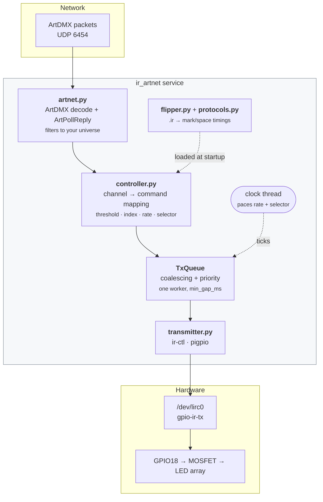
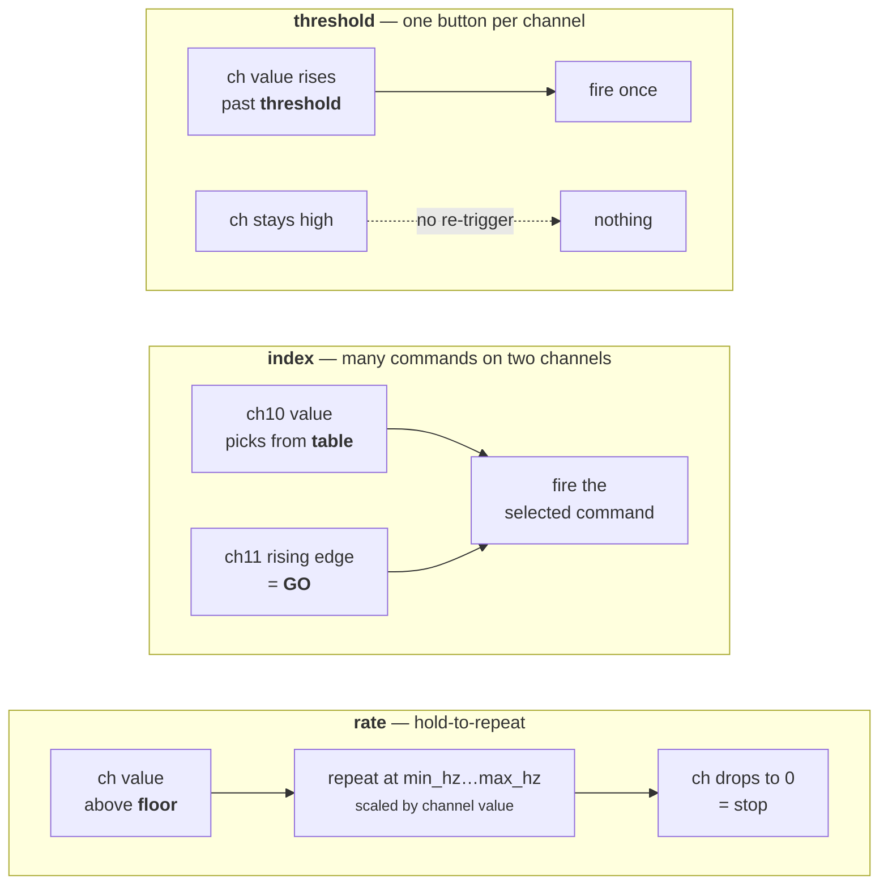
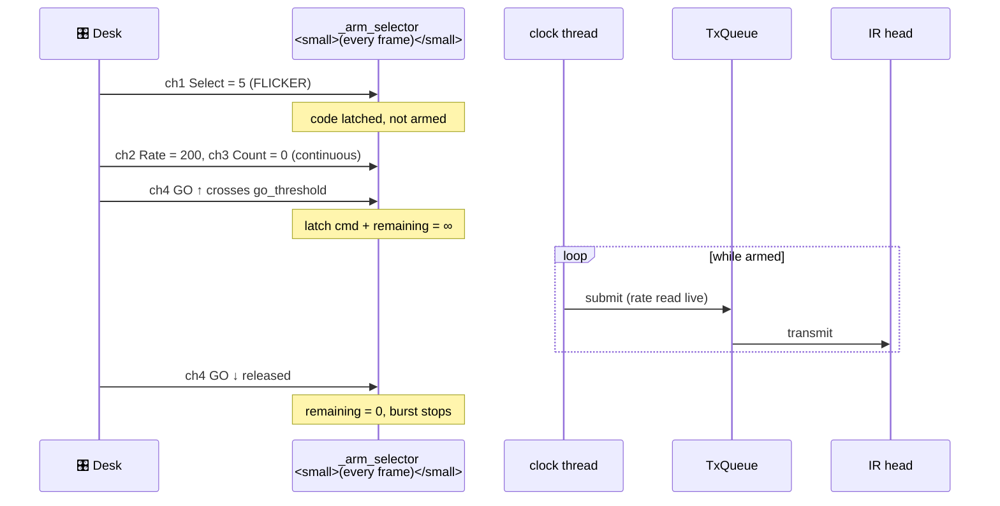
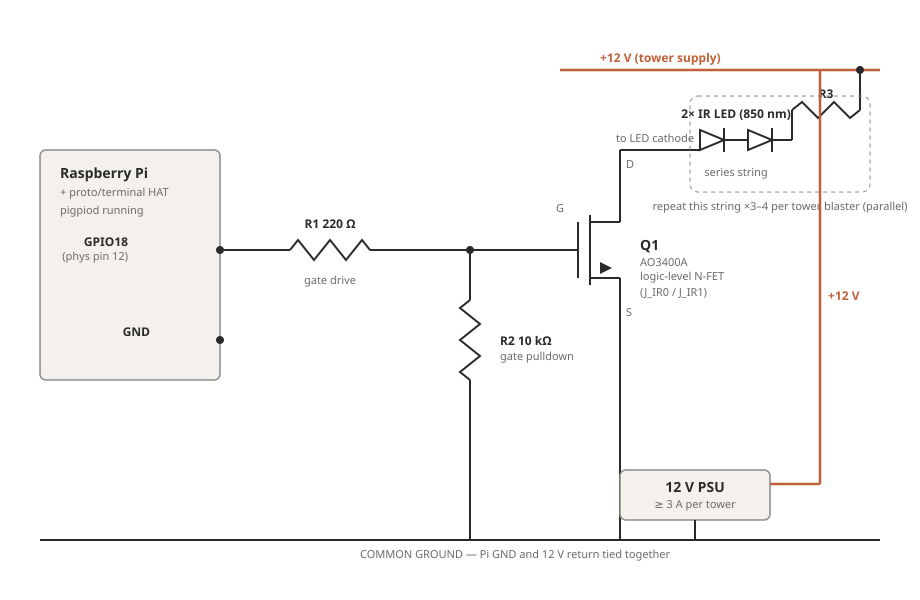
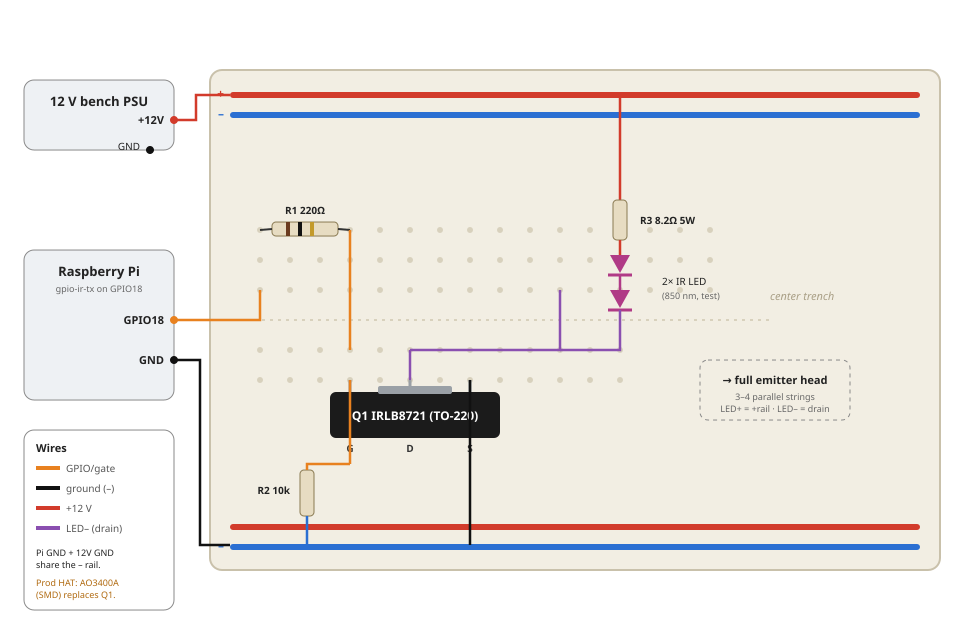
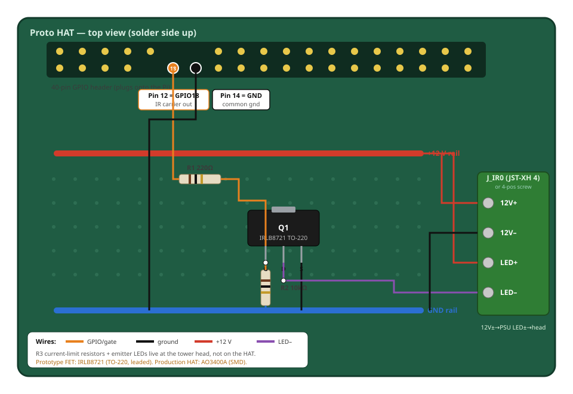
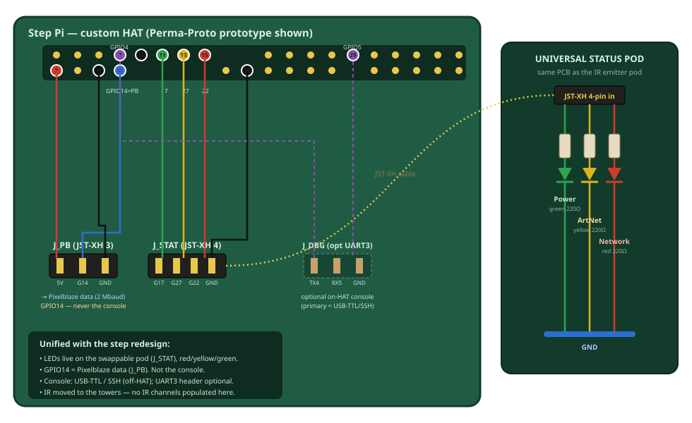
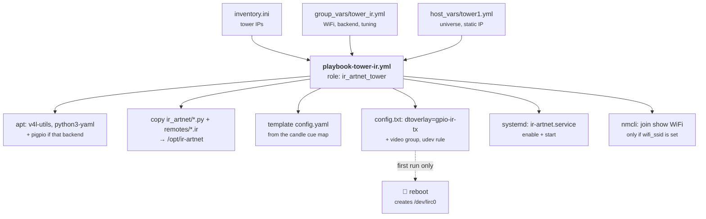
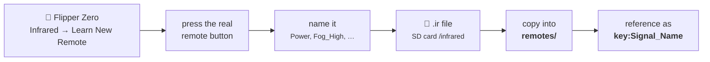

# ArtNet IR Blaster

**Fire IR remote-control commands from your lighting desk.** A Raspberry Pi listens
on Art-Net, watches the DMX channels you care about, and replays remote-control
codes you captured on a Flipper Zero through a high-power IR LED array.

<p align="center">
  <a href="LICENSE"></a>
  
  
  
  
</p>


> **Part of a larger design — see [UNIFIED-DESIGN.md](UNIFIED-DESIGN.md).** This repo is
> the **tower blaster** role. It transmits via the fleet-standard **`gpio-ir-tx` + `ir-ctl`**
> path by default (pigpio is a selectable fallback). Step-unit electronics live in
> [step-pi-status-serial.md](step-pi-status-serial.md).

---

## Why

Twelve step fixtures each carrying their own IR emitter is twelve things to build, wire,
and maintain. This consolidates the IR capability into **one or two high-power blaster
heads in the front towers**, driven straight from the desk — so the IR problem is
decoupled from the step electronics entirely, and the operator gets remote buttons as
ordinary DMX channels.

| | |
|---|---|
| **Input** | Art-Net (ArtDMX) on UDP 6454, one universe per instance |
| **Codes** | Flipper Zero `.ir` files — `raw` captures *and* `parsed` protocols |
| **Protocols** | NEC, NECext, Samsung32, Sony SIRC, RC5 (+ raw, always) |
| **Output** | `ir-ctl` on `/dev/lirc0` (default) or `pigpio` DMA waves (fallback) |
| **Trigger modes** | `threshold`, `index`, `rate`, `selector` |
| **Runtime deps** | PyYAML. That's it. |

---

## Architecture



**The path of one shot:**

1. **Receive** — `artnet.py` binds UDP 6454, decodes ArtDMX, drops anything that isn't
   your universe, and hands 512 channel values to the controller.
2. **Decide** — `controller.py` compares the frame against per-channel state and decides
   whether this is an edge, a selection change, or a repeat that's due.
3. **Queue** — a job goes into `TxQueue`. Stale repeats **coalesce** (a held look keeps at
   most one pending shot); a `priority: true` job (a blackout OFF) **jumps the line**.
4. **Transmit** — one worker thread serialises everything onto the shared LED bus, with a
   configurable minimum gap, so the array is never double-driven.

---

## Trigger modes

Every channel in `config.yaml` picks one of four modes. Pick by *what the operator does*:

| Mode | Desk gesture | Use it for |
|------|--------------|------------|
| `threshold` | bump a fader past a level | one button per channel — Power, Blast, Input |
| `index` | dial a value, hit GO | dozens of commands on two channels |
| `rate` | hold a fader up | hold-to-repeat — volume, dimmer |
| `selector` | a 4-channel fixture personality | the full remote as one desk fixture |



### `selector` — the whole remote as one DMX fixture

The richest mode: four channels give the operator a real fixture personality — pick a
code, pick a repeat rate, pick how many shots (or continuous), and fire.



Exactly one code is ever latched, so a desk mistake can send the wrong code but never
two conflicting codes at once. Rate is read **live**, so the operator can change speed
mid-burst. Generate this config straight from a capture:

```bash
python3 -m ir_artnet --gen-config --ir remotes/candles.ir --key candles > config.candles-selector.yaml
```

See [config.candles-selector.yaml](config.candles-selector.yaml) for the result and
[DMX-CHART.md](DMX-CHART.md) for the operator-facing channel chart.

---

## Hardware

A textbook low-side N-channel MOSFET switch: the Pi's 3.3 V GPIO carrier gates the FET at
38 kHz, and the FET switches the LED string current from a separate 12 V supply. Five
components — no board fabrication required.

<p align="center"></p>

<details>
<summary><b>Breadboard build</b> — prove it before you solder</summary>
<p align="center"></p>
</details>

<details>
<summary><b>Perma-Proto HAT solder layout</b> — the touring build</summary>
<p align="center"></p>
</details>

<details>
<summary><b>Step Pi HAT connector map</b> — the other population of the same board</summary>
<p align="center"></p>
</details>

**[hardware.md](hardware.md)** carries the complete build: the bill of materials (driver
stage, emitter head, Pi host kit, connectors and protection, mechanical), a cost roll-up,
the LED-array current math, the point-to-point solder table, and a bench-build checklist.

> ⚠️ **The one part choice that makes or breaks this:** use a *genuine* logic-level FET
> (AO3400A, IRLB8721, IRLZ44N). The ubiquitous blue "IRF520 module" is **not** logic-level
> — it runs hot and dim from a 3.3 V gate at 38 kHz, and your range dies with it.

---

## Install (on the Pi)

> **Fleet deploy:** this repo is vendored into `sandinak/ansible-raspi-dmx` as
> `external/ir-artnet-controller`, and the `ir_artnet_tower` role there does everything
> below (in a venv, with the cue map driven from inventory). Use
> `ansible-playbook playbooks/build/ir_towers.yml` for show machines. A standalone copy
> of the role also lives in [ansible/](ansible/). The manual steps here are for a bench Pi.

Tested on Raspberry Pi OS Bookworm and Trixie.

```bash
sudo apt update
sudo apt install -y v4l-utils python3-yaml     # v4l-utils provides ir-ctl

# enable the IR TX device (Ansible manages this in the fleet):
echo 'dtoverlay=gpio-ir-tx,gpio_pin=18' | sudo tee -a /boot/firmware/config.txt
sudo reboot                                    # creates /dev/lirc0

sudo mkdir -p /opt/ir-artnet
sudo cp -r ir_artnet config.yaml remotes /opt/ir-artnet/
```

> **Fallback backend:** to use pigpio instead of `ir-ctl`, set `transmitter.backend: pigpio`
> in `config.yaml`, `sudo apt install pigpio python3-pigpio`, and
> `sudo systemctl enable --now pigpiod`. pigpio generates the carrier and envelope in DMA
> hardware — microsecond-accurate at any carrier frequency — for odd captures `ir-ctl`
> struggles with.

Wire the driver stage per [hardware.md](hardware.md) (GPIO18 → MOSFET → LED array).

---

## Deploy with Ansible

[ansible/](ansible/) carries a standalone role that provisions a tower Pi end to end.



```bash
ansible-galaxy collection install -r ansible/requirements.yml
cp ansible/inventory.ini.example ansible/inventory.ini             # set tower IPs
cp ansible/host_vars/tower1.yml.example ansible/host_vars/tower1.yml

# First run enables the IR overlay, which needs a reboot:
ansible-playbook -i ansible/inventory.ini ansible/playbook-tower-ir.yml -e allow_reboot=true

# Subsequent code/config pushes (no reboot):
ansible-playbook -i ansible/inventory.ini ansible/playbook-tower-ir.yml
```

| Var | Where | Purpose |
|-----|-------|---------|
| `artnet_universe` | host_vars | must match the desk's output universe for that tower |
| `tower_static_ip` / `tower_gateway` | host_vars | reserved IP so the desk can unicast reliably |
| `wifi_ssid` / `wifi_psk` | group_vars (**vault the PSK**) | join the show AP |
| `ir_gpio_pin` | group_vars | `gpio-ir-tx` pin → MOSFET gate (default 18) |
| `transmit_backend` | group_vars | `ir-ctl` (default) or `pigpio` |
| `candle_on_max_hz`, `candle_jitter_ms` | group_vars | held-look tuning — see [DMX-CHART.md](DMX-CHART.md) |
| `allow_reboot` | group_vars / `-e` | let Ansible reboot after enabling the overlay |

The service runs unprivileged, so the role also adds `ir_artnet_user` to the `video`
group and installs a udev rule pinning `/dev/lirc0` to `root:video 0660` — without that,
`ir-ctl` can't open the device. Full details in [ansible/README.md](ansible/README.md).

---

## Capture your remotes on the Flipper



1. Flipper → **Infrared → Learn New Remote**, capture the button.
2. Give it a clear name (`Power`, `Input_HDMI1`, `Fog_High`, …).
3. Save. This appends a block to a `.ir` file under `infrared/` on the SD card.
4. Copy the `.ir` files into `remotes/` and point `config.yaml` at them.

> **Tip:** if a button uses a protocol not in the native list, capture it as **RAW** on
> the Flipper (hold the button during capture). RAW always replays verbatim — no protocol
> support needed.

---

## Configure

Edit `config.yaml`. DMX channel numbers are 1-based, like your desk. Commands are
referenced as `<file-key>:<signal-name>`.

```yaml
artnet:
  universe: 0                    # 15-bit port address (Net<<8 | Subnet<<4 | Universe)
  bind_ip: "0.0.0.0"

transmitter:
  backend: ir-ctl                # ir-ctl (default) | pigpio (fallback)
  lirc_device: /dev/lirc0
  gpio_pin: 18                   # pigpio backend only
  min_gap_ms: 60                 # minimum spacing between shots on the shared bus

ir_files:
  projector: "remotes/projector.ir"
  fog:       "remotes/fogger.ir"

channels:
  - channel: 1                   # threshold: a desk "button"
    mode: threshold
    threshold: 128
    command: "projector:Power"
    repeats: 2                   # some gear wants the frame sent twice

  - channel: 10                  # index: selector + GO drives many commands
    mode: index
    go_channel: 11
    go_threshold: 128
    table:
      "1-20":   "fog:Low"
      "21-40":  "fog:Medium"
      "41-255": "fog:High"

  - channel: 20                  # rate: hold-to-repeat
    mode: rate
    command: "projector:Volume_Up"
    max_hz: 8                    # value 255 → 8 presses/sec
```

Any mapping also accepts `priority: true` (jump the queue — use it for blackout OFFs)
and `repeats: N`. Rate-scaled modes accept `min_hz`, `max_hz`, `floor`, and `curve`.

---

## Run

```bash
# list every command your config can fire
python3 -m ir_artnet --config config.yaml --list

# transmit one command now (aim / cabling test)
python3 -m ir_artnet --config config.yaml --send projector:Power

# print decoded timings without transmitting
python3 -m ir_artnet --config config.yaml --dump projector:Power

# generate a selector/fixture config straight from a Flipper capture
python3 -m ir_artnet --gen-config --ir remotes/candles.ir --key candles > my-config.yaml

# LIVE DEBUG MONITOR — incoming DMX, per-channel action, tx stats
python3 -m ir_artnet --config config.yaml --watch

# run in the foreground (add -v for per-shot DEBUG logging)
python3 -m ir_artnet --config config.yaml -v
```

### Troubleshooting with `--watch`

`--watch` prints a refreshing table of every configured channel with its current DMX
value, the action the daemon computes from it, and transmit counters:

```
[tx 12  drop 0  coal 34  preempt 1]  frame=512B
   ch1   rate candles:ON v=200 @3.80Hz
   ch2   rate candles:OFF v=0 off PRIO
   ch10  idx sel=0->— GO[11]=0
```

| Symptom | Cause / fix |
|---|---|
| All channels `v=0` | The desk isn't reaching this box — check universe number, the tower's IP / unicast target, and the network. |
| `v=` moves but no `TX` in `-v` logs | Threshold not crossed, or the value is below `floor`. |
| `drop` climbing | Queue saturating — lower `max_hz`/`repeats` or raise `min_gap_ms`. |
| `coal` climbing | **Normal** for held looks — stale repeats collapsing. This is the design working. |
| `TX failed … /dev/lirc0` | The `gpio-ir-tx` overlay isn't active — reboot after enabling it (or the Ansible role hasn't rebooted yet). |
| Commands fire but gear ignores them | Aim and range. Bench-test with `--send`, add `repeats:`, add emitters to the head. |

### Run as a service

```bash
sudo cp ir-artnet.service /etc/systemd/system/
sudo systemctl daemon-reload
sudo systemctl enable --now ir-artnet
journalctl -u ir-artnet -f
```

---

## Test without a Pi

The decoding, mapping, and trigger logic all run on any machine — no GPIO required:

```bash
pip install pyyaml
python3 selftest.py
```

This parses the sample remotes, checks the protocol encoders, round-trips an ArtDMX
packet, and drives the full pipeline through a fake transmitter to confirm every trigger
mode fires correctly.

---

## Repository map

```
ir_artnet/
  __main__.py      service entry point + bench utilities (--send/--dump/--list/--watch/--gen-config)
  artnet.py        Art-Net (ArtDMX) UDP receiver + ArtPollReply
  controller.py    channel→command mapping, trigger modes, coalescing/priority transmit queue
  flipper.py       parse Flipper .ir files
  protocols.py     NEC / NECext / Samsung32 / SIRC / RC5 → raw timings
  transmitter.py   ir-ctl and pigpio transmit backends
ansible/           standalone deploy role (ir_artnet_tower) + playbook
remotes/*.ir       captured remotes (candles, fogger, projector)
examples/          status-LED demo (gpiozero)
config*.yaml       mappings — base, candles, candles-selector
selftest.py        offline end-to-end test
ir-artnet.service  systemd unit
```

### Documentation

| Document | What's in it |
|---|---|
| [UNIFIED-DESIGN.md](UNIFIED-DESIGN.md) | **Source of truth** — topology decision, the two HAT populations, divergence resolution, build sequence |
| [hardware.md](hardware.md) | Driver stage: schematic, BOM, HAT options, emitter head |
| [DMX-CHART.md](DMX-CHART.md) | Operator-facing channel chart for the desk |
| [step-pi-status-serial.md](step-pi-status-serial.md) | Step-unit status pod + serial/console (the other role) |
| [ansible/README.md](ansible/README.md) | Standalone Ansible deployment |
| [CONTRIBUTING.md](CONTRIBUTING.md) | How to contribute |

---

## Notes & limits

- **One universe per instance.** Run multiple instances with different configs if you
  need several universes.
- **pigpio waves** are chunked and chained automatically for long raw captures.
- The Pi must share the lighting network — **wired Cat5e recommended** for frame timing.
- IR is line-of-sight-ish. Aim the tower heads at the fixtures and expect bounce off the
  deck to help fill in.
- Flameless-candle receivers are *less* sensitive than AV gear — favour more emitters per
  head and verify range with `--send` before the show.

## License

See [LICENSE](LICENSE).
